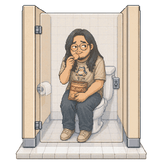
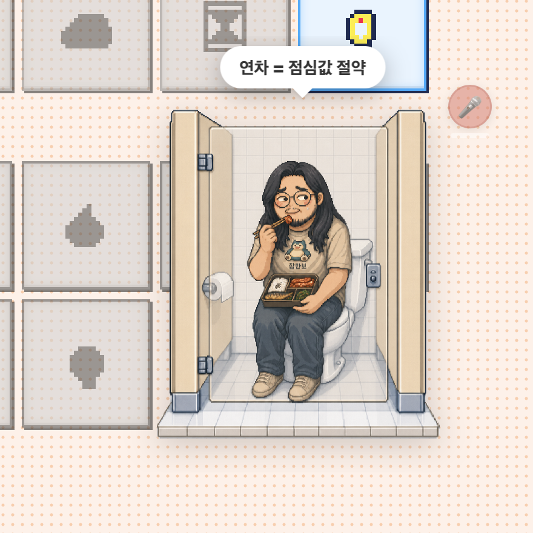

# 🍙 donggun — Hammerspoon Desktop Overlay

[](LICENSE)
[](https://www.apple.com/macos/)
[](https://www.hammerspoon.org/)
[](#)

> 화면 코너에서 조용히 혼밥하는 동건이. 누가 다가오면 들킬까봐 굳어버린다.
> **A microphone-reactive macOS desktop character, built on Hammerspoon + WebView.**

<p align="center">
  
  <br>
  <sub>🎤 켜둔 마이크에 소음이 들어오면 즉각 굳고, 조용해지면 천천히 다시 먹는다 (asymmetric smoothing)</sub>
</p>

<p align="center">
  
  <br>
  <sub>화장실 칸에서 들킨 동건이 — paused 상태 / 도시락 / "연차 = 점심값 절약"</sub>
</p>

---

## 📋 At a glance

| | |
|---|---|
| **Type** | Hammerspoon module — Lua entrypoint + WebView |
| **Platform** | macOS (Apple Silicon + Intel) |
| **Dependencies** | [Hammerspoon](https://www.hammerspoon.org/) ≥ 1.0, `python3` (Xcode CLT 기본 포함) |
| **Permissions** | Accessibility (필수), Microphone (옵션 — 소음 반응용) |
| **Window** | 360 × 360 px, transparent, always-on-top, all Spaces |
| **Hotkeys** | `Cmd+Shift+ {D, R, H, M}` + `Cmd+Shift+Drag` |
| **Network** | `127.0.0.1:8765` localhost only — 외부 트래픽 0 |
| **Install** | `./install.sh` (idempotent, init.lua 자동 백업) |
| **License** | MIT |

---

## 🎯 What it does

동건이는 화면 코너(기본: 우하단)에 떠 있는 **투명 데스크탑 캐릭터**다. 음식 6종을 약 8.5초마다 랜덤으로 바꿔 먹으며, 너드 유머 말풍선을 띄운다. **마이크가 켜져 있으면 주변 소음에 4단계로 반응**해 점점 굳어가다가, 조용해지면 천천히 다시 먹기 시작한다.

### 6 음식 (랜덤 순환)
감자칩 · 김밥 · 피자 · 햄버거 · 도시락 · 라면

### 6 상태

| State | Trigger | Animation |
|---|---|---|
| `eating` | default | 1.8s bobble + 0.42s chew |
| `pausing1` | mic avg ≥ 7 | mid frame, 80 ms hold |
| `pausing2` | mic avg ≥ 13 | mid frame, 80 ms hold |
| `paused` | mic avg ≥ 20 | tense bobble + 1.2 s hang time |
| `choking` | ~40 %/8 s 확률 | shake + rotate, 2 s lock |
| `changing` | ~35 %/5.5 s 확률 | sway + food swap, 1.8 s |

**비대칭 smoothing**: 놀라는 방향은 즉각 (`SMOOTH_UP = 0.25`, 새 값 75 %), 진정 방향은 천천히 (`SMOOTH_DN = 0.96`). 자율신경계 반응 모방. PAUSED 도달 후 **1.2 s hang time** (마리오 점프 정점 모사) 동안 굳어 있다가 단계적으로 풀린다.

---

## 🚀 Install

```bash
git clone https://github.com/Hyunwook-Kwon/lovable-eastsidegunn.git
cd lovable-eastsidegunn
./install.sh
```

설치 스크립트가 하는 일 ([install.sh](install.sh)):

1. `Hammerspoon.app`, `python3` 존재 확인
2. `~/.hammerspoon/init.lua` 가 있으면 타임스탬프 붙여 백업
3. `donggun/` → `~/.hammerspoon/donggun/` 로 복사 (자산 26 개 포함)
4. `~/.hammerspoon/init.lua` 끝에 `require("donggun")` 추가 (이미 있으면 skip — **idempotent**)
5. Hammerspoon 이 실행 중이면 `hammerspoon://reload` 트리거

설치 후 시스템 권한 부여:

- **System Settings → Privacy & Security → Accessibility → Hammerspoon ✓** (핫키/드래그)
- **System Settings → Privacy & Security → Microphone → Hammerspoon ✓** (소음 반응, 옵션)

Hammerspoon 자체가 처음이라면 먼저 설치하세요:

```bash
brew install --cask hammerspoon
open -a Hammerspoon
```

---

## ⌨️ Hotkeys

| Combo | Action |
|---|---|
| `Cmd+Shift+D` | 보이기 / 숨기기 토글 |
| `Cmd+Shift+R` | webview 새로고침 (`donggun.html` 수정 후 즉시 반영) |
| `Cmd+Shift+H` | 코너 순환 — 우하 → 좌하 → 좌상 → 우상 |
| `Cmd+Shift+M` | 마이크 on / off (회의 시작 전 양보용) |
| `Cmd+Shift+Drag` | 마우스로 동건이 자유 이동 |

핫키가 다른 앱과 충돌하면 [`donggun/init.lua`](donggun/init.lua) 의 `hs.hotkey.bind(...)` 줄들을 수정한 뒤 메뉴바 → **Reload Config**.

---

## 🗑️ Uninstall

```bash
./uninstall.sh
```

`~/.hammerspoon/donggun/` 디렉토리 삭제 + `init.lua` 에서 `require("donggun")` 라인 제거. 변경 전 init.lua 는 한 번 더 백업됩니다. Hammerspoon.app 자체는 건드리지 않음.

---

## 🗂️ Repo structure

```
lovable-eastsidegunn/
├── README.md                 # 사용자용 (한국어 primary)
├── AGENTS.md                 # AI/도구 에이전트용 가이드
├── CONTRIBUTING.md           # 🤝 기여 가이드 (음식 추가, 버그 제보 등)
├── LICENSE                   # MIT
├── .editorconfig             # 에디터 whitespace 규칙
├── .github/
│   └── ISSUE_TEMPLATE/
│       └── bug_report.md     # 🐛 버그 리포트 템플릿
├── install.sh                # idempotent installer → ~/.hammerspoon/donggun/
├── uninstall.sh              # safe uninstaller (creates backups)
├── donggun/                  # 그대로 ~/.hammerspoon/donggun/ 으로 복사됨
│   ├── init.lua              # Hammerspoon entrypoint (require("donggun"))
│   ├── donggun.html          # WebView 본체 — 상태 머신 + 오디오 분석 + 애니메이션
│   └── assets/               # 26 개 sprite PNG (v5)
└── docs/
    ├── demo.gif              # 비대칭 smoothing 애니메이션 (1MB, 320×320)
    └── screenshot.png        # 컨텍스트 스크린샷
```
lovable-eastsidegunn/
├── README.md            # this file
├── AGENTS.md            # AI/도구 에이전트용 가이드 (테스트·확장·금기)
├── LICENSE              # MIT
├── install.sh           # idempotent installer → ~/.hammerspoon/donggun/
├── uninstall.sh         # safe uninstaller (creates backups)
├── donggun/             # 그대로 ~/.hammerspoon/donggun/ 으로 복사됨
│   ├── init.lua         # Hammerspoon entrypoint (require("donggun") 가 이 파일 로드)
│   ├── donggun.html     # WebView 본체 — 상태 머신 + 오디오 분석 + 애니메이션
│   └── assets/          # 26 개 sprite PNG (v5)
└── docs/
    └── screenshot.png   # README 데모
```

---

## 🧠 How it works

```
┌─────────────────────────────────────────────────────┐
│  Hammerspoon (Lua)                                  │
│  ┌──────────────────────────────────────────────┐   │
│  │ donggun/init.lua                             │   │
│  │  ├─ hs.task → python3 -m http.server :8765   │   │
│  │  │  (root = scriptDir())                     │   │
│  │  ├─ hs.webview → renders donggun.html        │   │
│  │  ├─ hs.hotkey → Cmd+Shift+{D,R,H,M}          │   │
│  │  ├─ hs.eventtap → Cmd+Shift+Drag             │   │
│  │  └─ hs.spaces / screen watchers              │   │
│  └──────────────────────────────────────────────┘   │
└─────────────────────────────────────────────────────┘
                        │
                        ▼  http://127.0.0.1:8765/donggun.html
┌─────────────────────────────────────────────────────┐
│  WebView (WebKit, transparent)                      │
│  ┌──────────────────────────────────────────────┐   │
│  │ donggun/donggun.html                         │   │
│  │  ├─ getUserMedia → AudioContext analyser     │   │
│  │  ├─ smoothed avg level (asymmetric)          │   │
│  │  ├─ STAGE_ORDER ladder: eating → ... → paused│   │
│  │  └─ food rotation + choking events           │   │
│  └──────────────────────────────────────────────┘   │
└─────────────────────────────────────────────────────┘
```

**왜 localhost HTTP 서버를 쓰나?** WebKit 은 `file://` 컨텍스트에서 `getUserMedia` 를 차단한다. `http://127.0.0.1:*` 에서 띄워야 마이크 권한 prompt 가 뜨고 음향 분석이 가능하다.

**왜 `donggun` 변수가 global 인가?** Hammerspoon Console 에서 `donggun:reload()` 같이 라이브 디버깅하려면 global 이어야 한다. local 로 두면 webview 가 stale HTML 을 잡고 놓지 않아 디버깅 지옥에 빠진다.

**`scriptDir()` 가 하는 일.** `debug.getinfo(1, "S").source` 로 자기 자신 파일 경로를 알아내, Python http.server 의 working directory 와 webview 의 자산 base 를 같은 곳에 박는다. 덕분에 모듈이 `~/.hammerspoon/donggun/` 외 다른 곳에 깔려도 동작한다.

---

## 🧪 Troubleshooting

| 증상 | 해결 |
|---|---|
| 동건이가 안 보임 | Hammerspoon 메뉴바 → **Console** 에서 로그 확인 |
| `EADDRINUSE :8765` | `lsof -ti:8765 \| xargs kill` 로 점유 프로세스 정리 |
| 핫키 작동 안 함 | Accessibility 권한 미부여. 시스템 설정에서 켜고 Hammerspoon 재시작 |
| 마이크 prompt 안 뜸 | webview 가 `file://` 로 열린 상태. `./install.sh` 다시 실행 |
| 풀스크린 앱 위에 안 뜸 | macOS 보안 정책상 일부 앱(키체인 등) 위에는 못 뜸 — 정상 |
| Hammerspoon 이 자꾸 hide 됨 | `application.watcher` 가 0.1 s 후 unhide 함. 이게 싫으면 init.lua 의 해당 watcher 삭제 |
| 한국어 폰트 깨짐 | "Apple SD Gothic Neo" 가 시스템 폰트로 있어야. fallback: Pretendard / Segoe UI |

[`donggun.html`](donggun/donggun.html) 의 webview 우클릭 → **Inspect Element** 로 JS 콘솔도 열 수 있음 (`developerExtrasEnabled = true`).

---

## 🎭 Tone & concept

동건이는 **'화장실 칸에서 몰래 혼밥하는 너드'** 컨셉의 자캐다. 말풍선은 의도적으로:

- **너드 유머** — `P = NP 풀리면 인생 풀리지`, `monad = a monoid in the category of endofunctors`, `Tractatus 7번 명제 실천 중`
- **혼밥 현실** — `5분만... 5분만`, `들키면 끝장`, `구급차 부를 사람도 없어`
- **개발자 코어** — `PR 리뷰 = 사회생활`, `재택이 인생의 평화`, `tmux 5분할 = 평화`

말풍선 풀을 손보고 싶으면 [`donggun/donggun.html`](donggun/donggun.html) 의 `THOUGHTS` 객체를 편집하면 끝. webview 만 reload (`Cmd+Shift+R`) 하면 즉시 반영.

새 음식 추가·버그 제보·PR 등은 [CONTRIBUTING.md](CONTRIBUTING.md) 참고. AI 에이전트가 이 repo 를 만질 때는 [AGENTS.md](AGENTS.md) 가 진실의 원천.

---

## 📜 License

[MIT](LICENSE). 캐릭터 일러스트도 자유 사용 — 단 동건이 표정은 보존해주세요.
